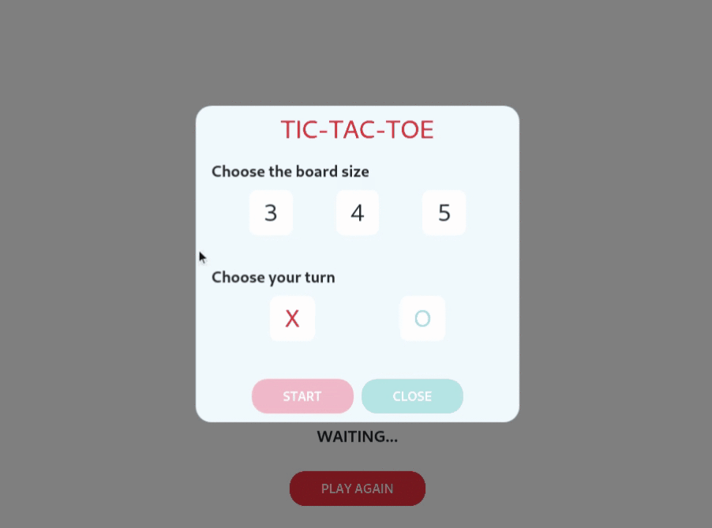

# Prerequisite
* Python 3 (Recommended Python 3.9)
* pip

# Setup virtual environment
## Install virtualenv
```
pip install virtualenv
```

## Create a virtual environment
```
cd $PROJECT-DIR
virtualenv venv
```

## Activate venv
```
source $PATH-TO-VENV/bin/activate
```

## Deactivate venv
```
deactivate
```

# Install necessary packages
## Flask
```
pip install flask
```
If you use Linux, you can install python-flask. For example in Arch Linux
```
sudo pacman -S python-flask
```

## Numpy
```
pip install numpy
```

# Run the Flask server
```
sudo python $PROJECT-DIR/app/run.py
```

After successfully running Flask server, you can open browser, enter your IP address and enjoin.


